# Cisco Packet Tracer Networking Lab

## Overview

This project is a multi-network Cisco Packet Tracer lab I built to practice configuring, testing, and troubleshooting common switching, routing, network services, and security technologies.

The lab started as a small two-VLAN network with a single router and switch. I continued expanding it as I learned new concepts, eventually adding multiple routers, additional VLANs, centralized DHCP and DNS services, OSPF, NAT/PAT, an Internet-facing connection, port forwarding, SSH management, port security, ACLs, and redundant switch links using STP.

I intentionally broke working configurations throughout the project so I could practice identifying where communication was failing instead of only following configuration steps.

The completed lab includes:

- VLAN segmentation
- 802.1Q trunking
- Router-on-a-stick
- Inter-VLAN routing
- DHCP
- DHCP relay
- DNS
- SSH switch management
- Standard and extended ACLs
- Port security
- Static routing
- Default routing
- OSPF
- NAT/PAT
- HTTP services
- Static PAT and port forwarding
- Internet-edge traffic filtering
- STP redundancy and failover
- Layer 2 and Layer 3 troubleshooting
- End-to-end validation

The repository contains the completed Packet Tracer file, exported device configurations, and 64 screenshots documenting the build, failures, troubleshooting, repairs, and final validation.

---

## Repository Contents

```text
packet-tracer-networking-lab/
├── README.md
├── packet_tracer_networking_lab.pkt
├── Configs/
│   ├── ROUTER01.txt
│   ├── ROUTER02.txt
│   ├── SWITCH01.txt
│   ├── SWITCH02.txt
│   ├── SWITCH03.txt
│   └── readme.md
└── screenshots/
    ├── 01-network-topology.png
    ├── ...
    └── 64-final-validation-ssh-management.png
```

### Lab Files

- [Completed Packet Tracer Lab](./packet_tracer_networking_lab.pkt)
- [ROUTER01 Configuration](Configs/ROUTER01.txt)
- [ROUTER02 Configuration](Configs/ROUTER02.txt)
- [SWITCH01 Configuration](Configs/SWITCH01.txt)
- [SWITCH02 Configuration](Configs/SWITCH02.txt)
- [SWITCH03 Configuration](Configs/SWITCH03.txt)
- [Screenshots](screenshots/)

---

# Final Network Design

The topology grew throughout the project. The completed design contains an internal multi-VLAN network, two internal routers, remote networks, centralized services, redundant switching, and a simulated ISP/Internet connection.

```text
                              INTERNET-SERVER
                               198.51.100.10
                                      |
                                    ISP01
                          198.51.100.1 / 203.0.113.1
                                      |
                               203.0.113.0/30
                                      |
                            G0/2 203.0.113.2
                                  ROUTER01
                         ____________|____________
                        /                         \
               G0/0 802.1Q trunk                 G0/1
                       |                       10.0.0.1/30
                    SWITCH01                        |
                 _____|_______                   ROUTER02
                /     |       \                 10.0.0.2/30
               /      |        \                 /         \
          VLAN 10  VLAN 20   VLAN 50        192.168.30   192.168.40
             IT      SALES       HR             |             |
              \        |        /            SWITCH02      PC-REMOTE02
               \_______|_______/                |
                       |                   PC-REMOTE01
                 VLAN 99 MGMT              DHCP/DNS SERVER
                       |
                 SWITCH01 SVI
                  192.168.99.2

                  SWITCH01
                 /        \
          Fa0/23 trunk   Fa0/24 trunk
               /            \
              /              \
                   SWITCH03
                      |
                  PC-STP01
```

The two links between SWITCH01 and SWITCH03 provide Layer 2 redundancy. STP keeps one path forwarding and the other available as a backup.

---

# Addressing Plan

| Network / Device | Address | Purpose |
| --- | --- | --- |
| VLAN 10 | `192.168.10.0/24` | IT network |
| ROUTER01 G0/0.10 | `192.168.10.1` | IT default gateway |
| PC-IT01 | `192.168.10.10` | IT workstation |
| PC-IT02 | `192.168.10.11` | IT workstation |
| INTERNAL-WEB | `192.168.10.20` | Internal HTTP server |
| PC-STP01 | `192.168.10.30` | STP redundancy test client |
| VLAN 20 | `192.168.20.0/24` | Sales network |
| ROUTER01 G0/0.20 | `192.168.20.1` | Sales default gateway |
| PC-SALES01 | `192.168.20.10` | Sales workstation |
| PC-SALES02 | `192.168.20.11` | Sales workstation |
| VLAN 50 | `192.168.50.0/24` | HR network |
| ROUTER01 G0/0.50 | `192.168.50.1` | HR default gateway / DHCP relay interface |
| PC-HR01 | `192.168.50.10` | HR workstation |
| VLAN 99 | `192.168.99.0/24` | Management network |
| ROUTER01 G0/0.99 | `192.168.99.1` | Management gateway |
| SWITCH01 VLAN 99 SVI | `192.168.99.2` | Switch management address |
| ROUTER01 G0/1 | `10.0.0.1/30` | ROUTER01-to-ROUTER02 transit link |
| ROUTER02 G0/0 | `10.0.0.2/30` | ROUTER02-to-ROUTER01 transit link |
| Remote LAN | `192.168.30.0/24` | Remote network behind ROUTER02 |
| ROUTER02 G0/1 | `192.168.30.1` | Remote LAN gateway |
| PC-REMOTE01 | `192.168.30.10` | Remote workstation |
| DHCP/DNS SERVER | `192.168.30.20` | Central DHCP and DNS server |
| Remote LAN 2 | `192.168.40.0/24` | Second remote network |
| ROUTER02 G0/2 | `192.168.40.1` | Remote LAN 2 gateway |
| PC-REMOTE02 | `192.168.40.10` | Remote workstation |
| ISP transit | `203.0.113.0/30` | ROUTER01-to-ISP connection |
| ISP01 | `203.0.113.1` | ROUTER01 next hop / simulated ISP |
| ROUTER01 G0/2 | `203.0.113.2` | Public-facing NAT address |
| Internet LAN | `198.51.100.0/24` | Simulated Internet network |
| INTERNET-SERVER | `198.51.100.10` | External DNS/HTTP test server |

---

# VLAN Segmentation

I initially created separate VLANs for the IT and Sales departments and later added HR and Management.

```text
VLAN 10 - IT
VLAN 20 - SALES
VLAN 50 - HR
VLAN 99 - MANAGEMENT
```

Important SWITCH01 access-port assignments include:

```text
Fa0/1 -> VLAN 10 -> PC-IT01
Fa0/2 -> VLAN 10 -> PC-IT02
Fa0/3 -> VLAN 20 -> PC-SALES01
Fa0/4 -> VLAN 20 -> PC-SALES02
Fa0/5 -> VLAN 50 -> PC-HR01
Fa0/6 -> VLAN 10 -> INTERNAL-WEB
```

Separating the departments into VLANs gives each department its own Layer 2 broadcast domain even though the devices share the same physical switch.

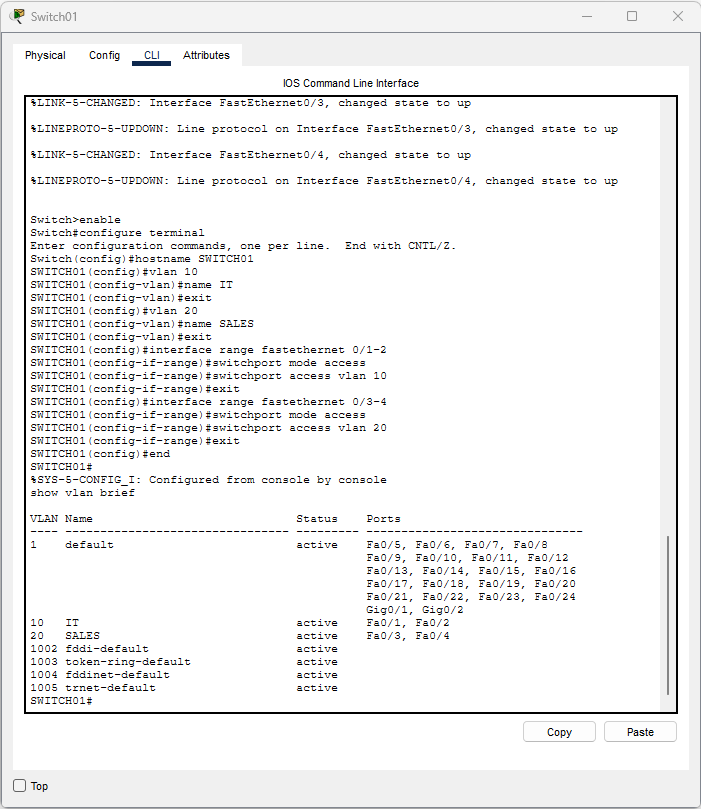

---

# 802.1Q Trunking and Router-on-a-Stick

SWITCH01 connects to ROUTER01 using an 802.1Q trunk on `Gi0/1`.

Instead of dedicating a separate physical router interface to every VLAN, ROUTER01 uses subinterfaces on `G0/0`.

```text
G0/0.10 -> VLAN 10 -> 192.168.10.1
G0/0.20 -> VLAN 20 -> 192.168.20.1
G0/0.50 -> VLAN 50 -> 192.168.50.1
G0/0.99 -> VLAN 99 -> 192.168.99.1
```

Each subinterface uses an 802.1Q VLAN ID so ROUTER01 knows which logical network an incoming Ethernet frame belongs to.

This allows multiple isolated VLANs to share one physical switch-to-router connection while ROUTER01 performs routing between the networks.

Before routing was configured, hosts in different VLANs could not communicate.

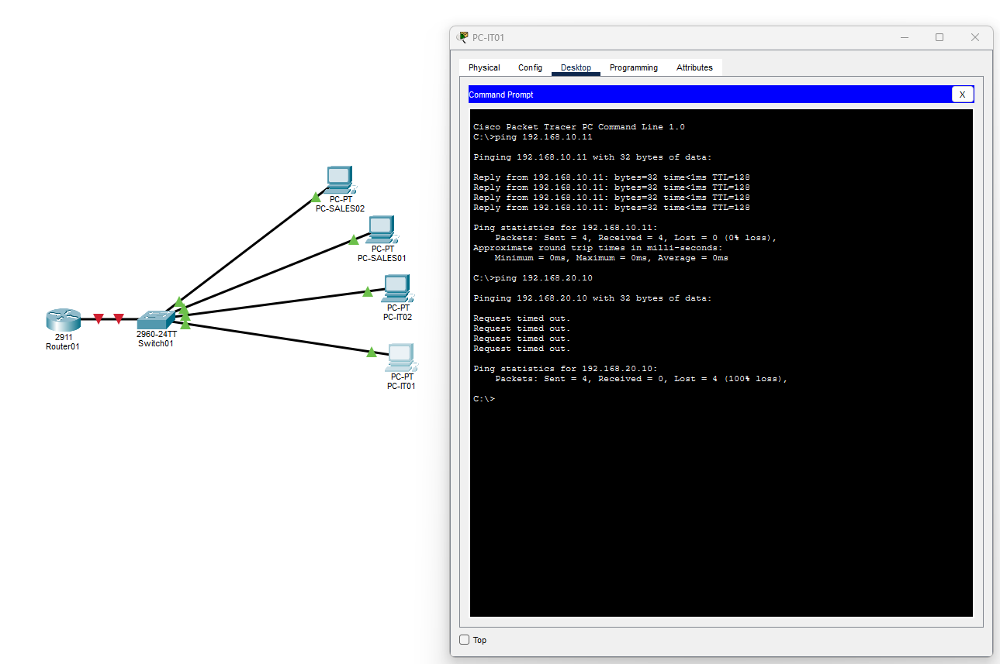

After the trunk and router subinterfaces were configured, inter-VLAN communication worked.

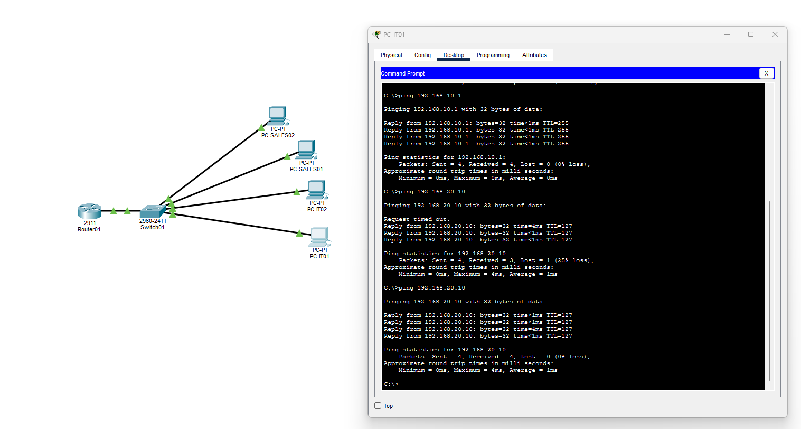

---

# DHCP

## Local DHCP

ROUTER01 provides DHCP for the IT and Sales networks.

```text
IT
Network: 192.168.10.0/24
Gateway: 192.168.10.1
DNS: 192.168.30.20

SALES
Network: 192.168.20.0/24
Gateway: 192.168.20.1
DNS: 192.168.30.20
```

Infrastructure addresses `.1` through `.9` are excluded from the IT and Sales DHCP pools.

Clients successfully received addresses from the correct network.

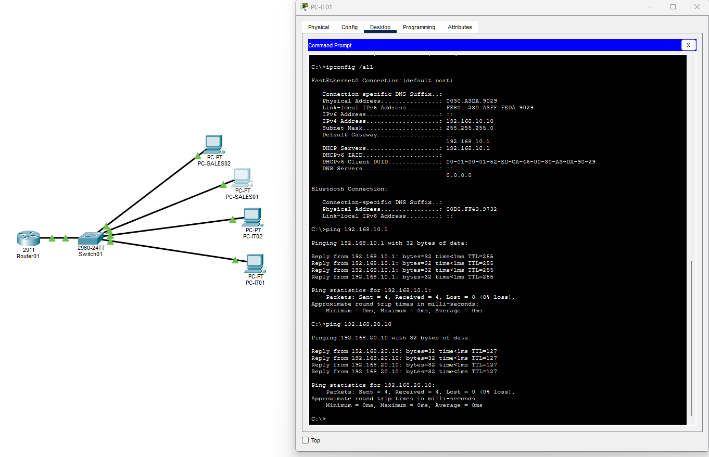

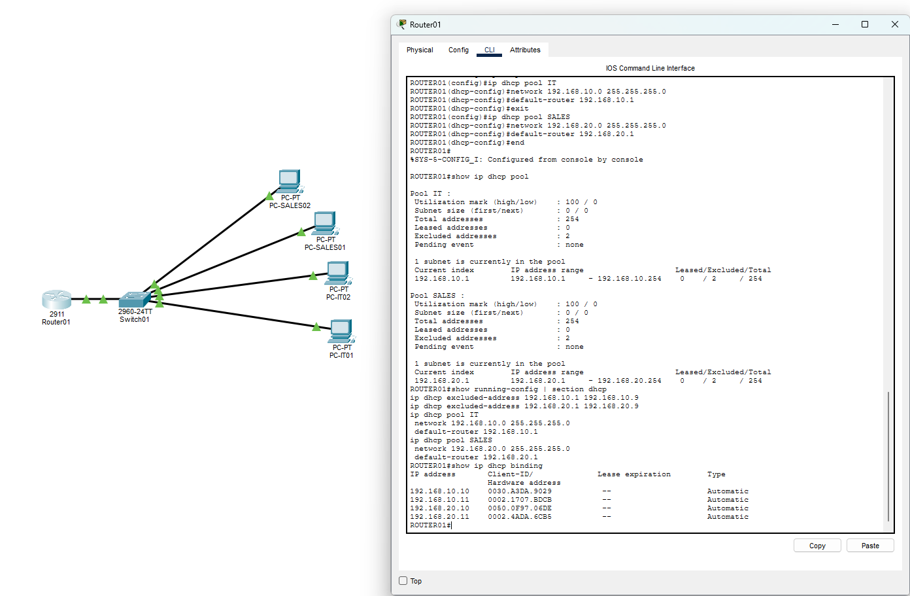

---

# Centralized DHCP and DHCP Relay

I later added a centralized DHCP/DNS server at:

```text
192.168.30.20
```

The server is on a different subnet behind ROUTER02.

I created VLAN 50 for HR and used:

```text
ip helper-address 192.168.30.20
```

on ROUTER01's `G0/0.50` subinterface.

A DHCP Discover starts as a local broadcast. Routers normally do not forward broadcasts between networks, so the HR client could not directly reach a DHCP server on `192.168.30.0/24`.

The helper address allows ROUTER01 to relay the DHCP request to the remote server.

I first tested HR before the relay was working and confirmed the DHCP request failed.

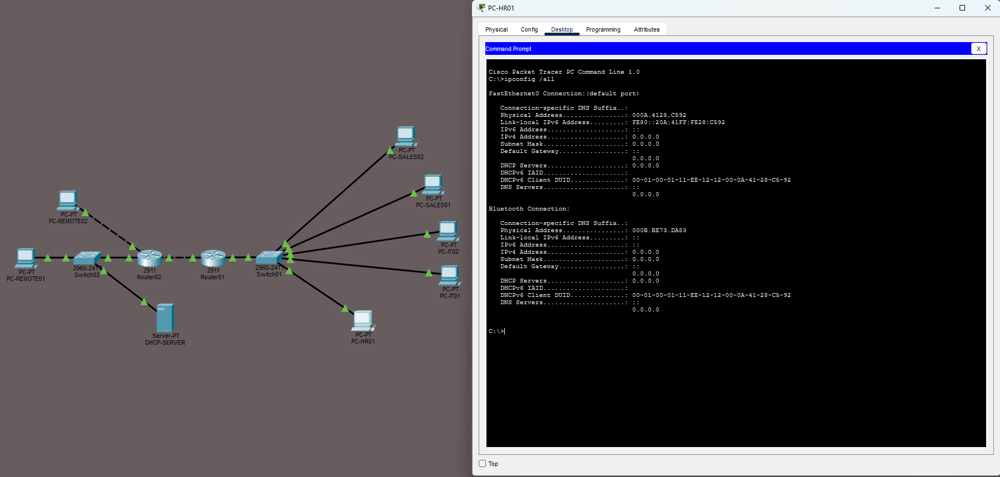

After configuring and correcting the centralized DHCP scope, PC-HR01 successfully received:

```text
Address: 192.168.50.10
Gateway: 192.168.50.1
DHCP Server: 192.168.30.20
DNS Server: 192.168.30.20
```

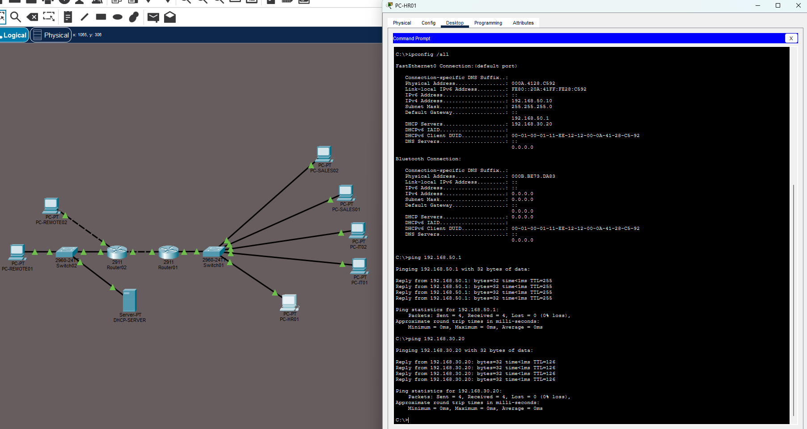

---

# Access Control Between VLANs

I configured an extended ACL on the Sales router subinterface to control ICMP traffic between Sales and IT.

The policy allows echo replies from Sales while preventing Sales hosts from initiating ICMP echo requests toward the IT subnet.

```text
permit icmp 192.168.20.0 0.0.0.255 192.168.10.0 0.0.0.255 echo-reply
deny   icmp 192.168.20.0 0.0.0.255 192.168.10.0 0.0.0.255 echo
permit ip any any
```

The ACL is intentionally specific to ICMP. It does not block all Sales-to-IT traffic.

Testing confirmed:

```text
IT -> Sales ping       ALLOWED
Sales -> IT ping       BLOCKED
```

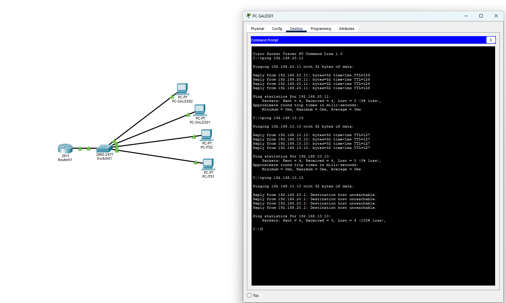

I also used ACL match counters to verify traffic was hitting the intended rules.

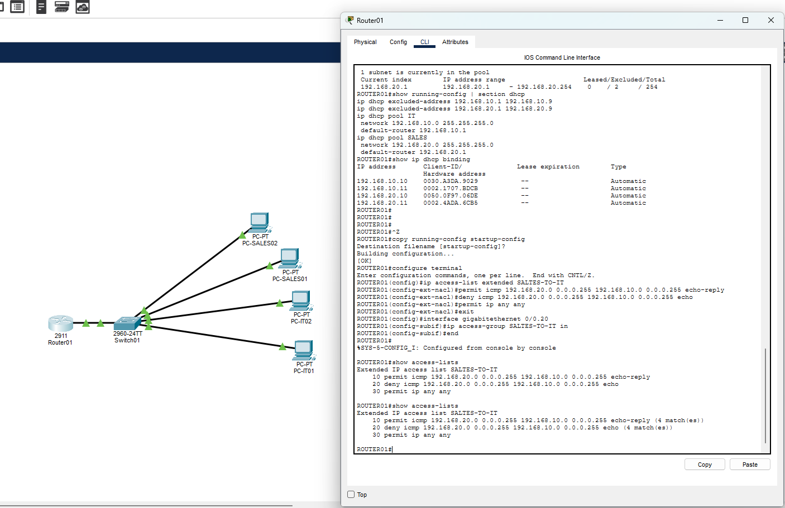

---

# Management VLAN and SSH

I created VLAN 99 as a dedicated management network.

```text
ROUTER01: 192.168.99.1
SWITCH01: 192.168.99.2
```

SWITCH01 uses the VLAN 99 SVI for remote management and has:

```text
ip default-gateway 192.168.99.1
```

I configured SSH version 2 using a local administrative account.

Remote CLI access was then tested from PC-IT01.

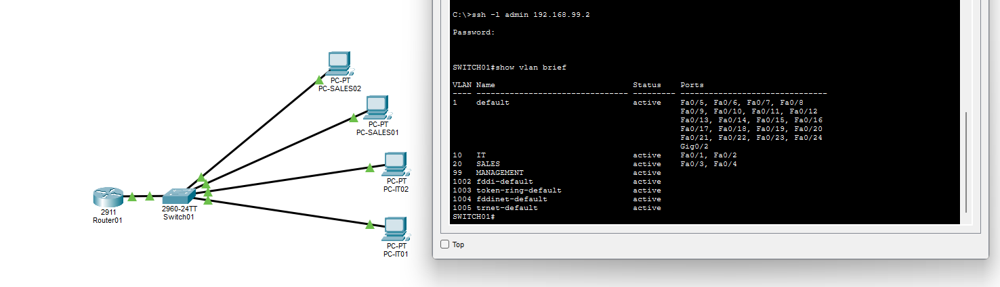

---

# Management Access Control

SSH access to SWITCH01 is restricted using a standard ACL applied to the VTY lines.

```text
permit 192.168.10.0 0.0.0.255
deny any
```

This allows hosts from the IT subnet to manage SWITCH01 while preventing other user VLANs from opening an SSH session.

```text
IT -> SWITCH01 SSH       ALLOWED
Sales -> SWITCH01 SSH    DENIED
```

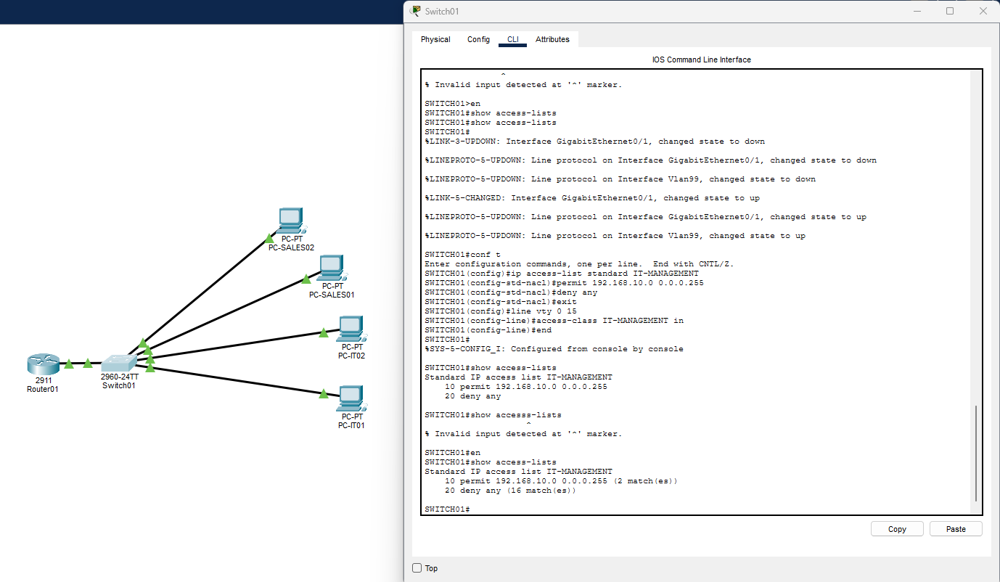

---

# Port Security

I configured sticky port security on the primary user access ports on SWITCH01.

The protected ports allow one learned MAC address and use the shutdown violation action.

I verified that each access port learned its expected client MAC address.

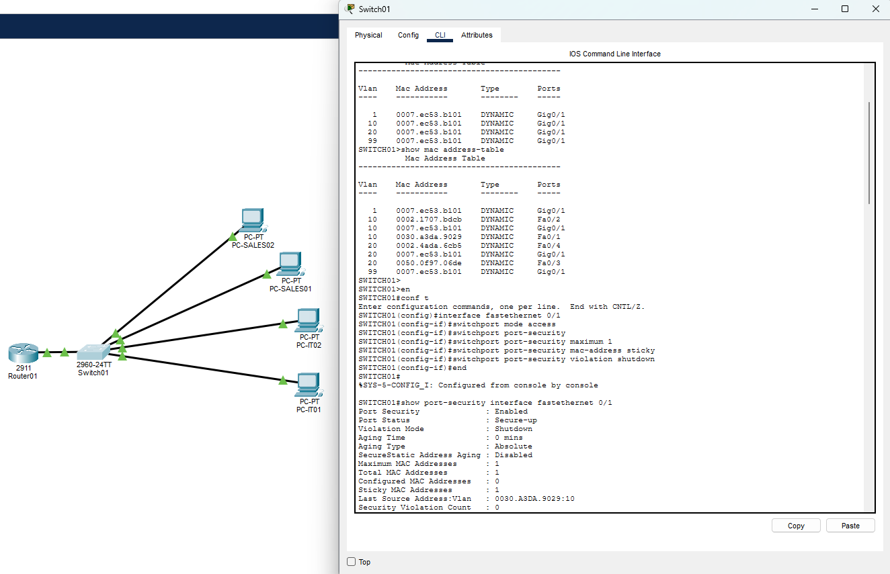

I then disconnected the authorized IT workstation from `Fa0/1` and connected an unauthorized PC.

SWITCH01 detected the unexpected MAC address and placed the interface into an err-disabled / secure-shutdown state.

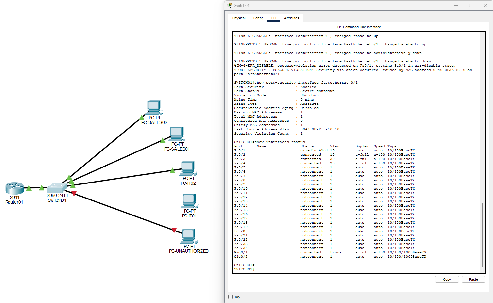

After reconnecting the authorized workstation, I recovered the interface with:

```text
shutdown
no shutdown
```

and verified the authorized client could communicate again.

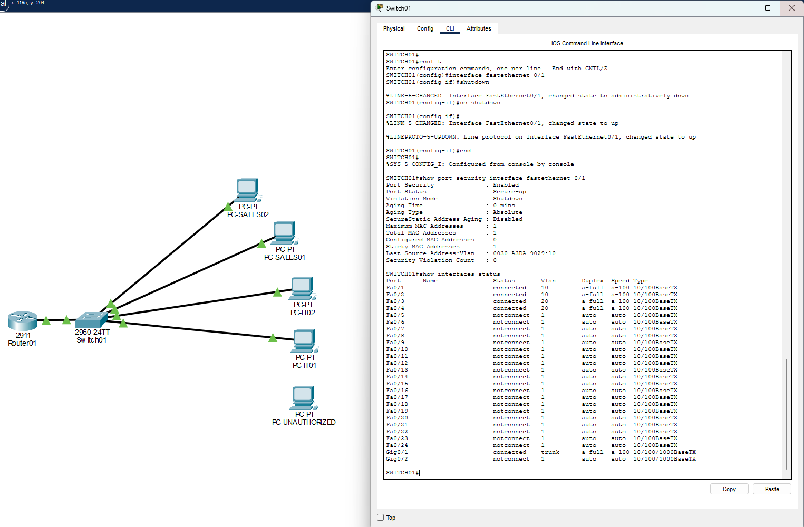

I later applied the same protection across `Fa0/1` through `Fa0/4`.

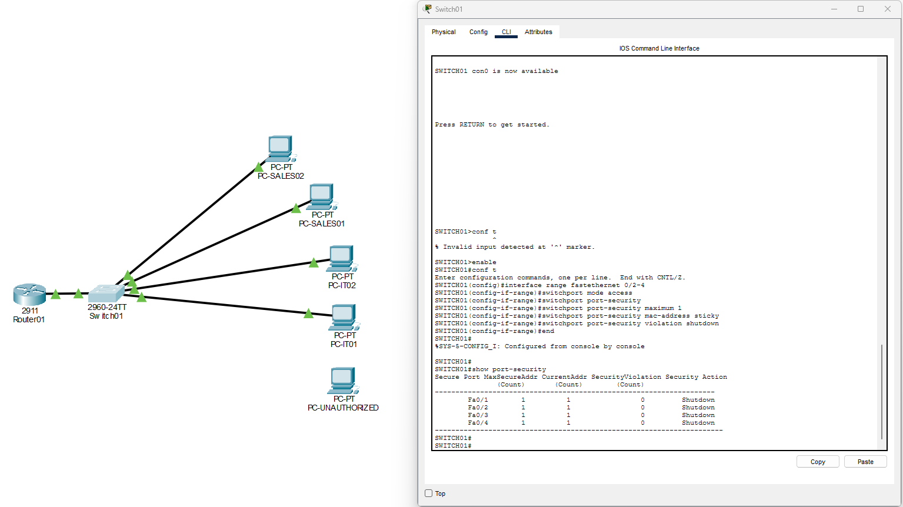

---

# Static Routing

I expanded the topology by adding ROUTER02 and a remote `192.168.30.0/24` network.

The point-to-point link between the routers uses:

```text
ROUTER01: 10.0.0.1/30
ROUTER02: 10.0.0.2/30
```

Initially ROUTER01 did not know how to reach `192.168.30.0/24`.

PC-IT01 received a destination-unreachable response when attempting to reach the remote host.

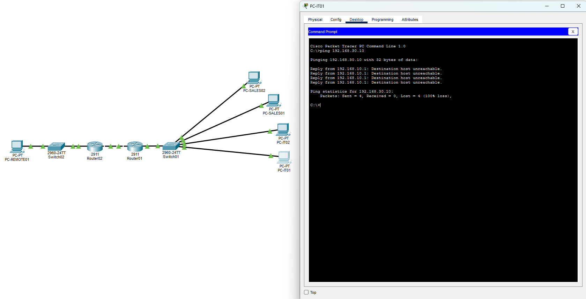

I added a static route on ROUTER01:

```text
ip route 192.168.30.0 255.255.255.0 10.0.0.2
```

The failure then changed from destination unreachable to request timed out.

That change was useful because it showed the forward route now existed, but ROUTER02 still lacked a return route to the IT network.

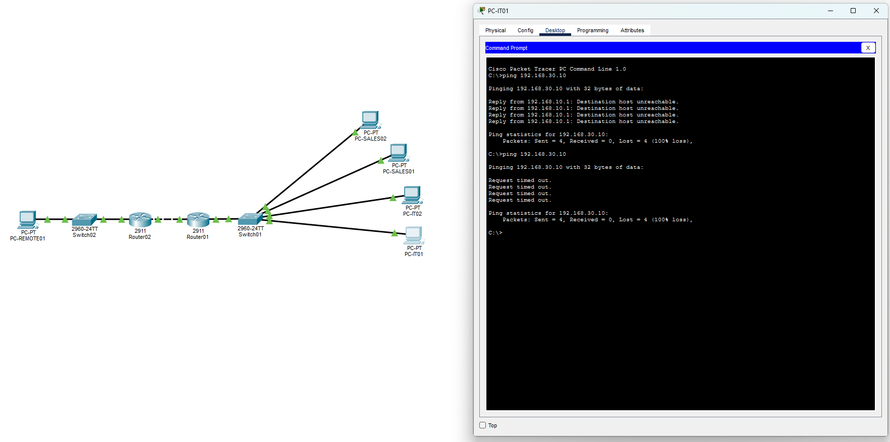

After configuring return routing on ROUTER02, end-to-end connectivity worked.

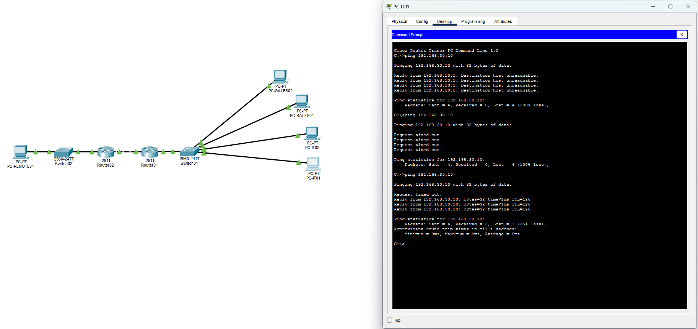

---

# Traceroute

I used traceroute to verify the path from the IT network to the remote network.

```text
1  192.168.10.1
2  10.0.0.2
3  192.168.30.10
```

This confirmed the expected Layer 3 path:

```text
PC-IT01
   ->
ROUTER01
   ->
ROUTER02
   ->
PC-REMOTE01
```

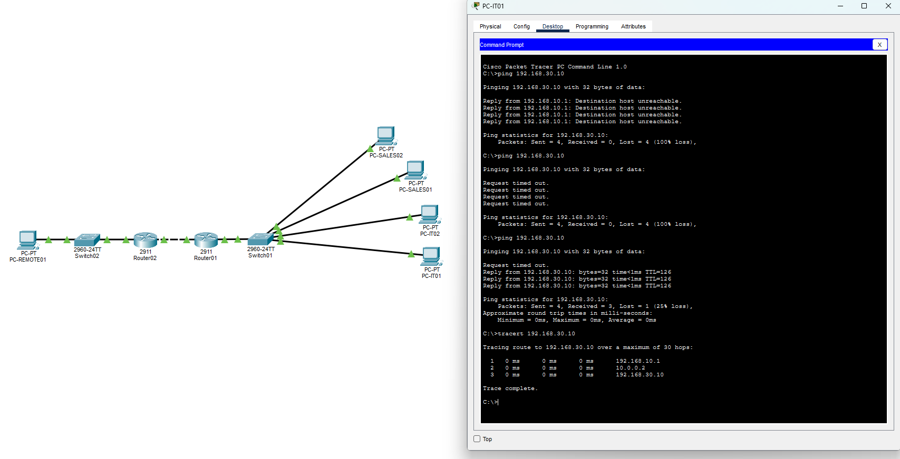

---

# Default Routing

I tested replacing multiple specific return routes on ROUTER02 with a default route:

```text
0.0.0.0/0 -> 10.0.0.1
```

This allowed ROUTER02 to forward traffic for unknown internal destinations toward ROUTER01 without maintaining a static route for every VLAN.

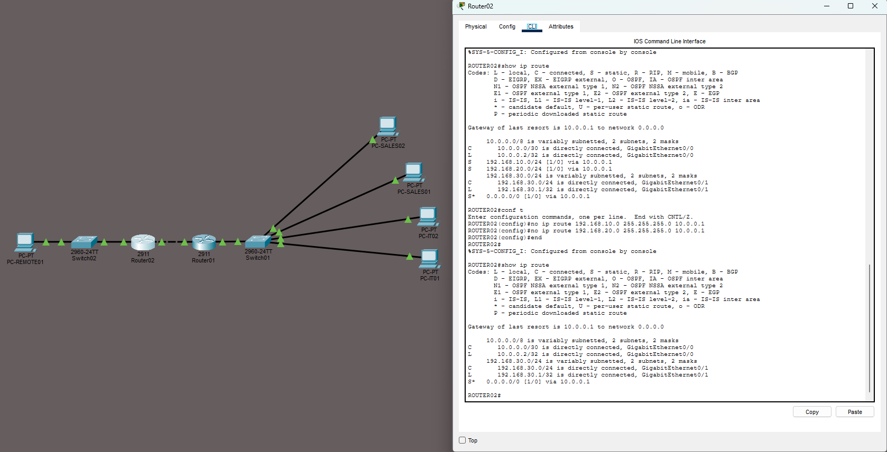

---

# OSPF

After demonstrating static routing, I replaced the internal static routes with OSPF.

ROUTER01:

```text
Router ID: 1.1.1.1
```

ROUTER02:

```text
Router ID: 2.2.2.2
```

The routers form an adjacency over:

```text
10.0.0.0/30
```

All internal OSPF networks are in Area 0.

LAN interfaces are configured as passive interfaces so their networks are advertised without attempting to form OSPF neighbors with user devices.

The routers successfully reached the `FULL` neighbor state.

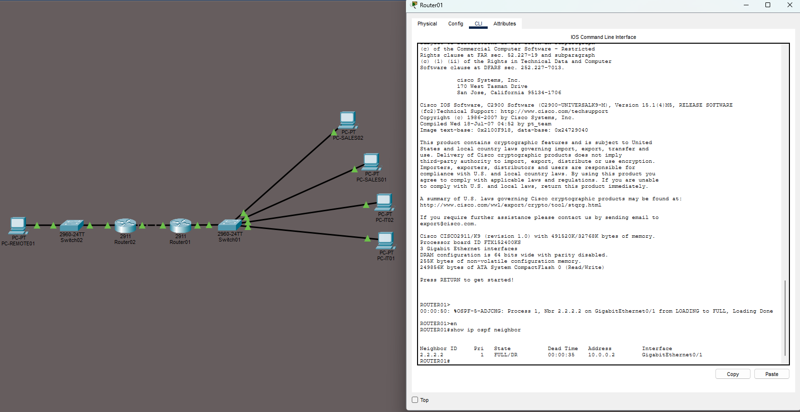

ROUTER02 dynamically learned the networks behind ROUTER01.

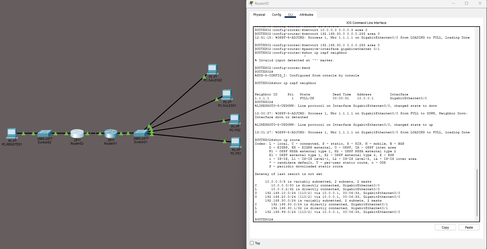

I later added the `192.168.40.0/24` network to ROUTER02 and advertised it through OSPF without adding a new route manually to ROUTER01.

ROUTER01 automatically learned it through OSPF.

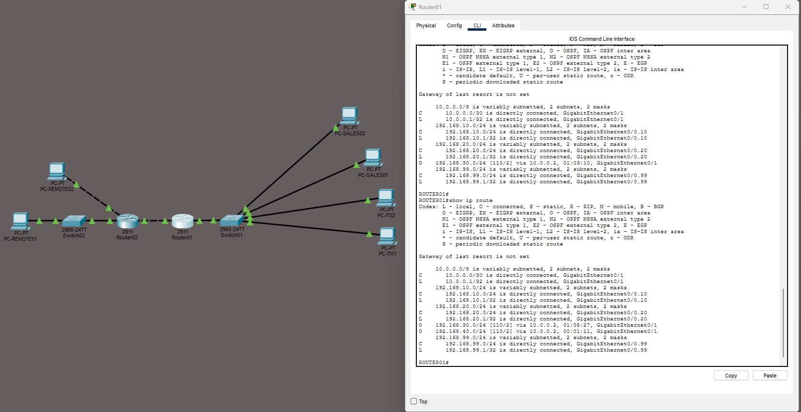

---

# OSPF Troubleshooting

I deliberately created an OSPF area mismatch on the router-to-router link.

ROUTER01 remained in Area 0 while ROUTER02's transit network was temporarily moved into Area 1.

The physical connection and IP connectivity were still available, but the OSPF adjacency disappeared.

As a result, OSPF-learned remote routes disappeared from ROUTER01's routing table.

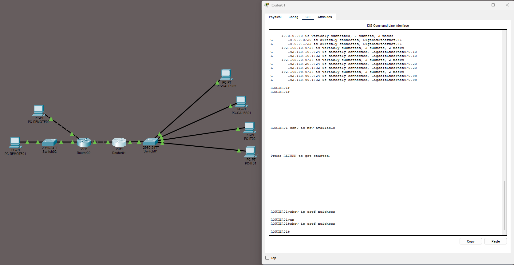

Restoring both sides of the link to Area 0 caused the routers to automatically rebuild the adjacency and return to `FULL`.

The dynamic routes then reappeared without being manually re-entered.

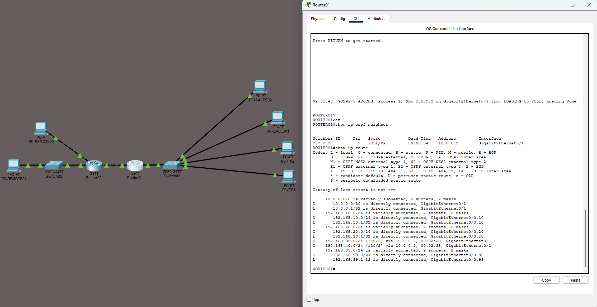

---

# Simulated Internet Connection

I added ISP01 and INTERNET-SERVER to simulate connectivity between private internal networks and an external network.

ROUTER01's public-facing interface is:

```text
203.0.113.2/30
```

ISP01 is:

```text
203.0.113.1
```

INTERNET-SERVER is:

```text
198.51.100.10
```

ROUTER01 uses this default route:

```text
0.0.0.0/0 -> 203.0.113.1
```

---

# NAT and PAT

The internal networks use private IPv4 addresses, so I configured PAT on ROUTER01 for outbound Internet access.

ROUTER01 uses `G0/2` as the NAT outside interface and the internal VLAN/router interfaces as NAT inside interfaces.

PAT allows multiple private hosts to share the same public-facing IP address:

```text
203.0.113.2
```

Initially external connectivity failed before NAT was configured.

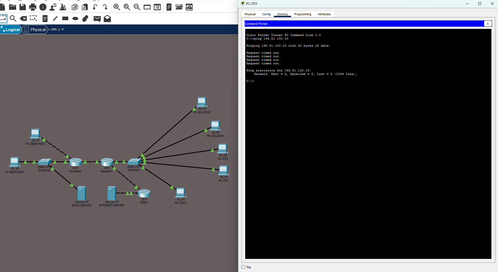

After PAT was configured, internal clients successfully reached INTERNET-SERVER.

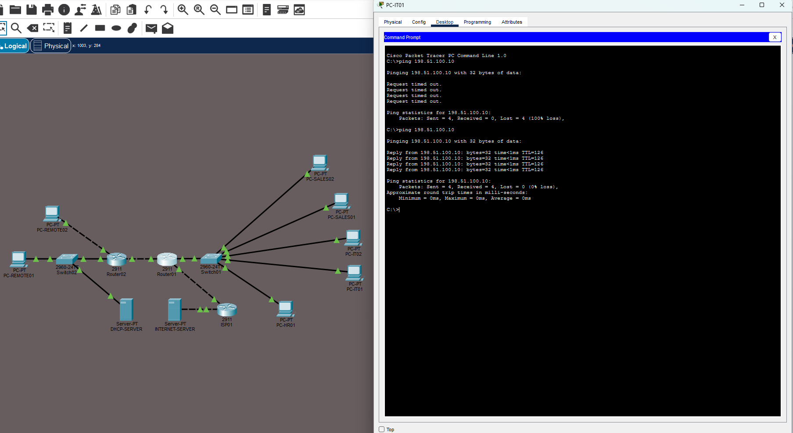

I used the NAT translation table to verify the private-to-public mappings created by live traffic.

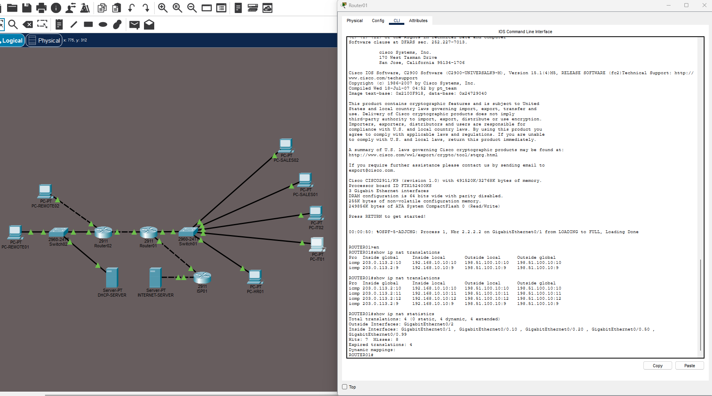

I also generated traffic from multiple internal hosts and confirmed PAT maintained separate translations for the sessions while using the same public IP.

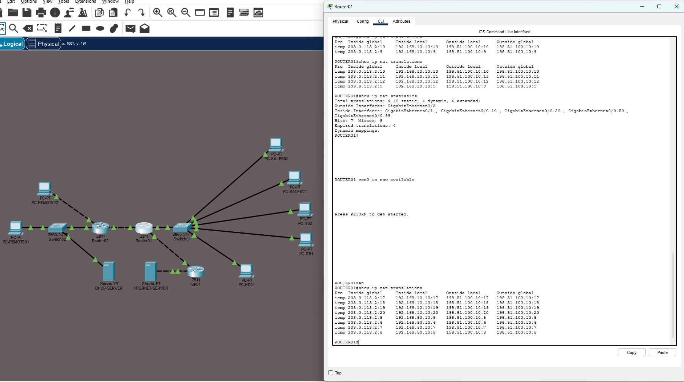

---

# DNS

The centralized server at `192.168.30.20` also provides DNS service to internal clients.

I configured the lab domain:

```text
cobo.test
```

and created a record for:

```text
www.cobo.test
```

pointing to the simulated external web server:

```text
198.51.100.10
```

Before the correct DNS record existed, clients could reach the server by IP but could not resolve its hostname.

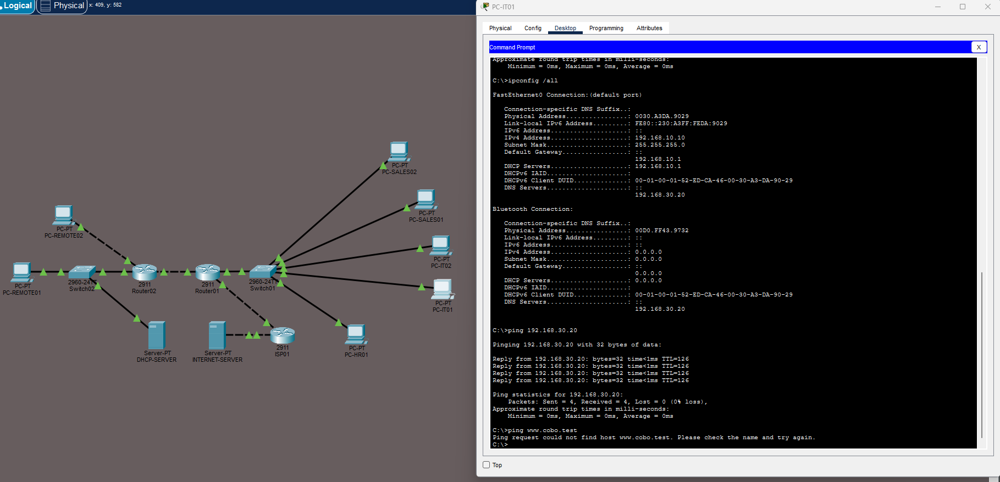

I also deliberately configured an incorrect A record and verified that the hostname resolved to the wrong destination.

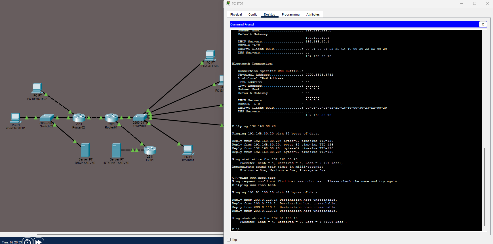

After correcting the record, `www.cobo.test` resolved to the correct address.

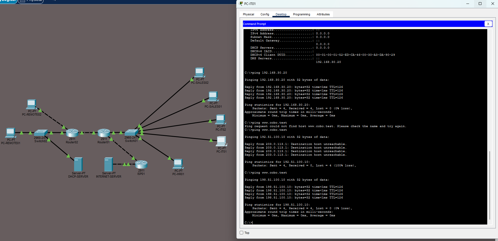

---

# HTTP and DNS Integration

I enabled HTTP service on INTERNET-SERVER.

Internal clients were then able to browse to:

```text
http://www.cobo.test
```

rather than manually entering an IP address.

This test combined several parts of the lab:

```text
Client
  ->
DNS lookup
  ->
Default gateway
  ->
ROUTER01
  ->
PAT
  ->
ISP01
  ->
INTERNET-SERVER
```

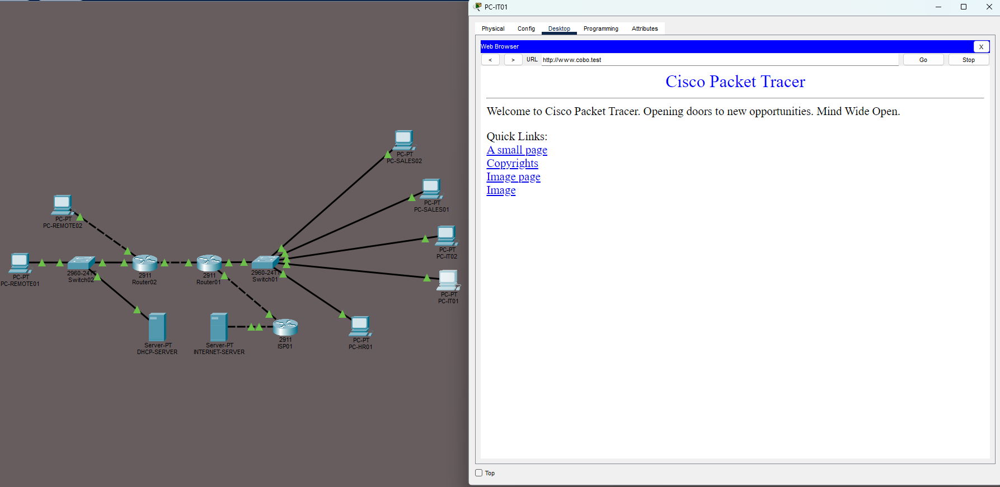

The NAT translation table also showed TCP translations created by the HTTP sessions.

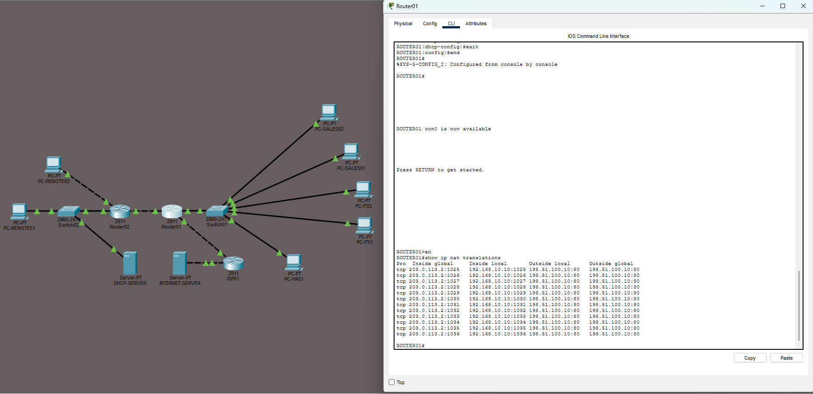

---

# HR DHCP and DNS Troubleshooting

After adding the HR network, I tested failures involving its centralized services.

PC-HR01 could initially reach the remote server by IP while hostname resolution failed.

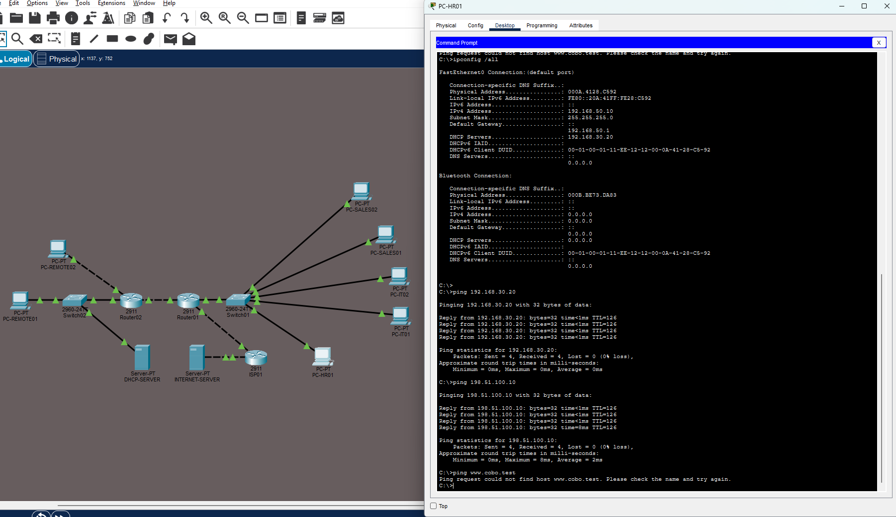

I then encountered a DHCP renewal failure while testing the remote DHCP configuration.

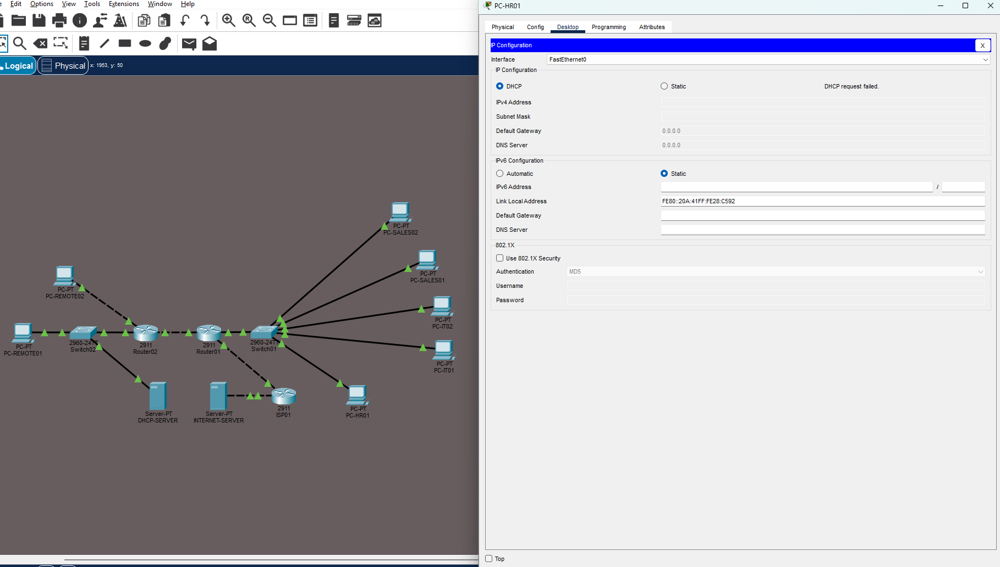

The issue was traced to the centralized DHCP pool configuration.

After correcting the pool, HR successfully received the expected IP address, gateway, DHCP server, and DNS server information.

Hostname resolution then worked again.

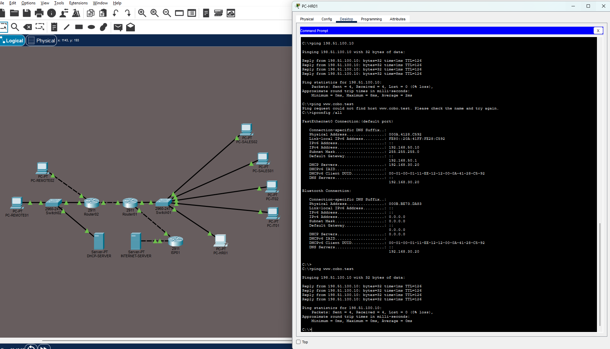

---

# Multiple HTTP Clients Through PAT

I generated HTTP traffic from multiple internal clients at the same time.

ROUTER01 translated the sessions to the same public IP while keeping the connections separate using TCP port information.

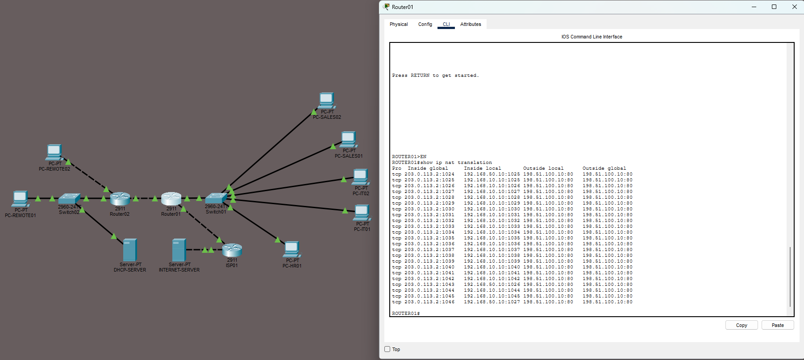

This demonstrated why PAT allows many internal devices to share one public IPv4 address without confusing the return traffic.

---

# Static PAT and Port Forwarding

Outbound PAT allows internal users to initiate connections toward the Internet.

I also wanted to demonstrate the opposite direction: allowing an outside host to reach one specifically published internal service.

I added INTERNAL-WEB:

```text
192.168.10.20
```

and configured a static TCP translation:

```text
192.168.10.20:80
        <->
203.0.113.2:80
```

Before the port-forwarding rule existed, INTERNET-SERVER could not open the internal website using ROUTER01's public address.

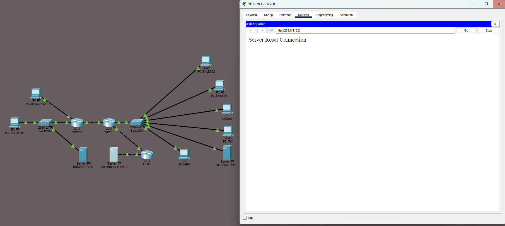

After configuring static PAT, I checked the NAT translation table and confirmed the permanent TCP mapping between the outside address and INTERNAL-WEB.

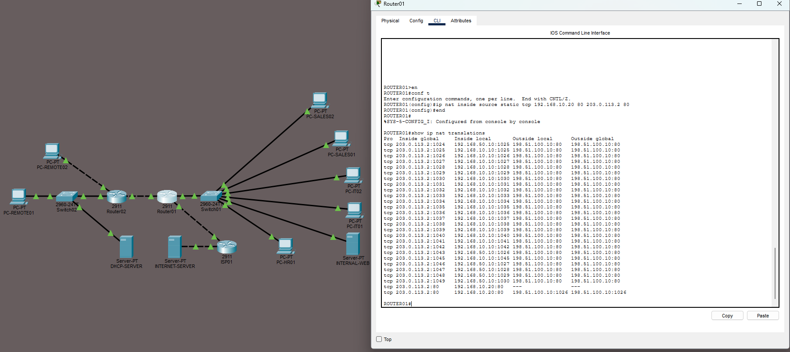

Browsing to:

```text
http://203.0.113.2
```

from the outside then reached:

```text
192.168.10.20:80
```

inside the network.

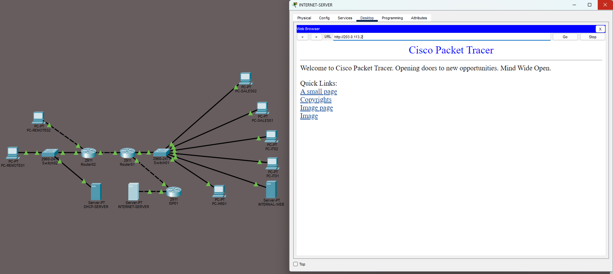

---

# Internet-Edge ACL

Publishing an internal HTTP service does not mean every type of unsolicited outside traffic should be accepted.

I created an inbound extended ACL on ROUTER01's ISP-facing `G0/2` interface.

The policy permits:

```text
HTTP to 203.0.113.2:80
Established TCP return traffic
ICMP echo replies
ICMP unreachable messages
```

and denies other unmatched inbound IP traffic.

Before applying the ACL, INTERNET-SERVER could ping ROUTER01's public-facing address.

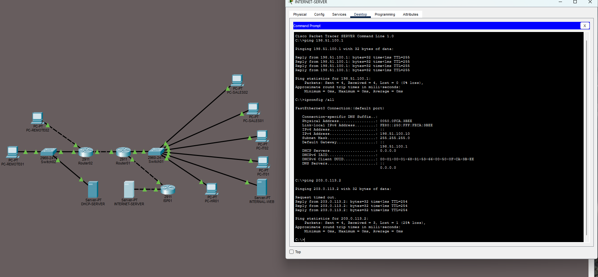

After applying the ACL, outside-initiated ping traffic was blocked.

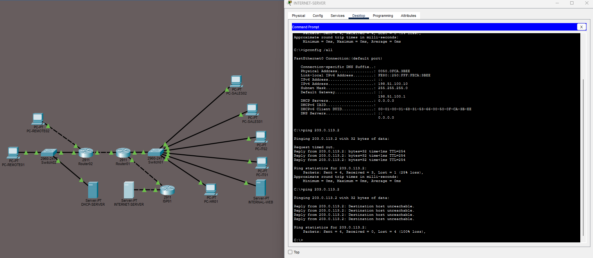

The deliberately published HTTP service still worked.

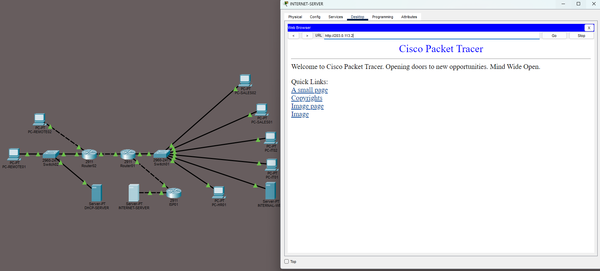

ACL match counters showed traffic hitting the expected permit and deny entries.

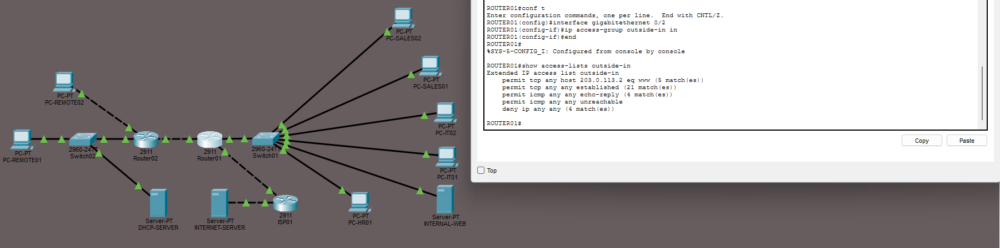

This demonstrated the difference between publishing a specific service and broadly allowing unsolicited traffic from an outside network.

---

# STP and Layer 2 Redundancy

To finish the switching portion of the lab, I added SWITCH03 and connected it to SWITCH01 with two trunks:

```text
SWITCH01 Fa0/23 <-> SWITCH03 Fa0/23
SWITCH01 Fa0/24 <-> SWITCH03 Fa0/24
```

Two active Layer 2 paths between the same switches would create a switching loop.

I configured SWITCH01 as the STP root for:

```text
VLAN 10
VLAN 20
VLAN 50
VLAN 99
```

STP selected one of SWITCH03's trunk interfaces as the forwarding root port and placed the redundant interface into an alternate blocking state.

```text
Fa0/23 -> Root FWD
Fa0/24 -> Altn BLK
```

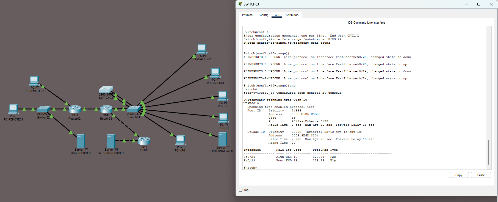

I then disconnected the active `Fa0/23` trunk.

STP automatically moved `Fa0/24` from the backup role into forwarding.

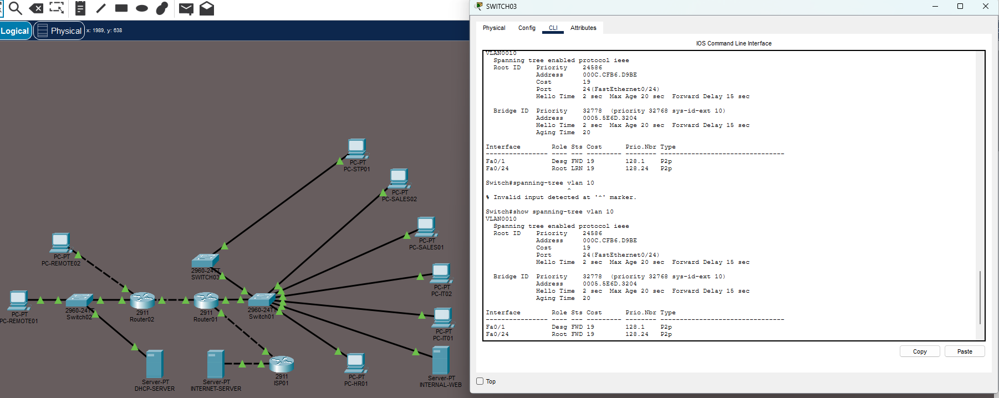

PC-STP01 remained able to reach the VLAN 10 gateway through the backup path.

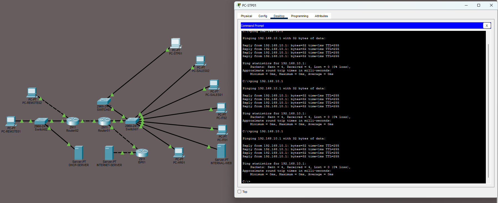

After reconnecting `Fa0/23`, STP reconverged and restored the redundant topology with one forwarding path and one blocked backup path.

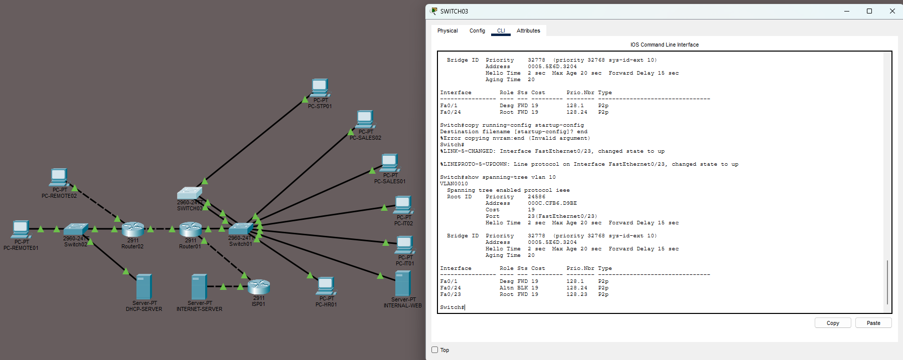

---

# Troubleshooting Scenarios

Troubleshooting was a major part of this lab.

Instead of only configuring a working network, I intentionally introduced or encountered failures and worked through the symptoms before applying a fix.

| Scenario | Symptom | Diagnosis / Fix |
| --- | --- | --- |
| Wrong Sales VLAN | Local Sales connectivity and gateway failed | Found incorrect access VLAN with `show vlan brief`; restored VLAN 20 |
| Broken trunk | Same-VLAN traffic worked but gateway and remote traffic failed | `show interfaces trunk` showed trunk missing; restored trunk mode |
| Incorrect default gateway | Local traffic worked but remote traffic failed | Corrected PC gateway from `.254` to `.1` |
| Port security violation | Access port became err-disabled | Identified unauthorized MAC; reconnected authorized host and reset interface |
| Missing static route | ROUTER01 returned destination unreachable | Added forward route toward ROUTER02 |
| Missing return route | Ping changed to request timed out | Added return routing on ROUTER02 |
| OSPF area mismatch | Physical link worked but OSPF neighbor disappeared | Compared OSPF configuration and restored matching Area 0 |
| Missing DHCP relay | Remote DHCP server could not serve HR | Added `ip helper-address` on the HR client-facing interface |
| Incorrect DHCP scope | HR DHCP request failed | Corrected centralized server pool |
| Missing DNS record | IP connectivity worked but hostname failed | Added correct DNS record |
| Wrong DNS A record | Hostname resolved to incorrect address | Corrected record to `198.51.100.10` |
| NAT not configured | Private clients could not reach Internet server | Configured NAT inside/outside and PAT overload |
| Missing static PAT | Outside HTTP connection failed | Published `192.168.10.20:80` through `203.0.113.2:80` |
| Outside ACL | Unwanted outside ping blocked while HTTP remained reachable | Used protocol/port-specific inbound ACL rules |
| STP link failure | Primary switch trunk disconnected | STP automatically activated redundant path |

A useful pattern throughout the lab was narrowing the problem based on what still worked.

For example:

```text
Same subnet works, remote subnet fails
-> investigate gateway or routing

Same VLAN fails
-> investigate Layer 2 first

Direct router-to-router ping works, OSPF neighbor is missing
-> investigate OSPF rather than physical connectivity

IP address works, hostname fails
-> investigate DNS

Forward route added but ping still times out
-> investigate the return path
```

---

# MAC Address and ARP Verification

I used the switch MAC address table to verify how SWITCH01 learned client MAC addresses and associated them with switchports.

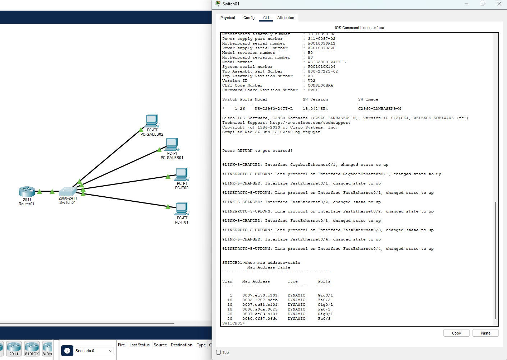

I also inspected ROUTER01's ARP table and routing table to connect Layer 2 address resolution with Layer 3 forwarding decisions.

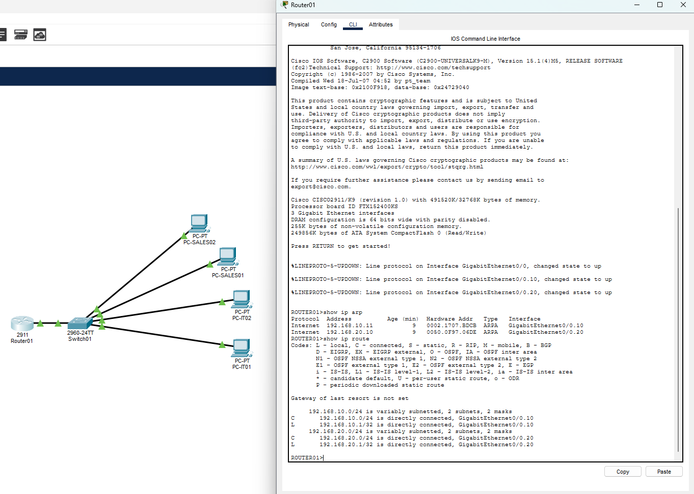

This helped reinforce the distinction between:

```text
IP destination  = final Layer 3 destination
MAC destination = next Layer 2 hop on the local network
```

---

# Final Validation

After the network build was complete, I performed a final validation rather than assuming earlier configurations still worked after later changes.

The HR workstation was used to verify centralized services and end-to-end connectivity.

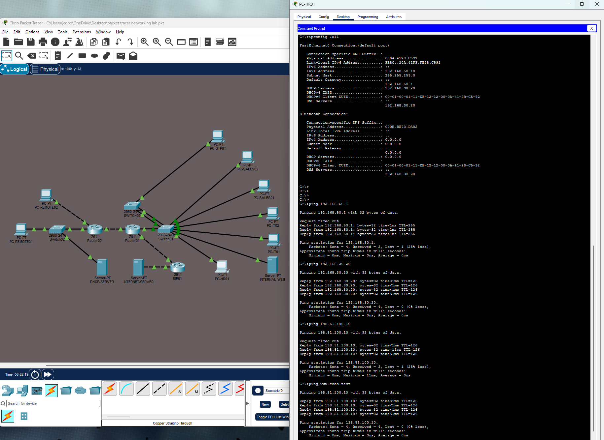

ROUTER01 was checked for:

- OSPF neighbor state
- OSPF learned routes
- default routing
- NAT configuration
- outside ACL configuration

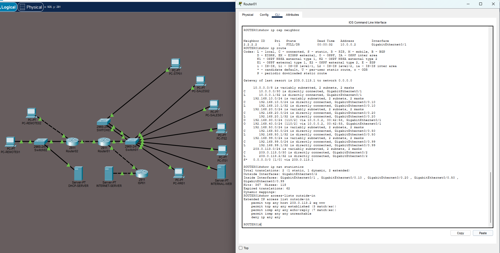

PC-IT01 then successfully opened an SSH session to SWITCH01 at:

```text
192.168.99.2
```

and executed switch commands remotely.

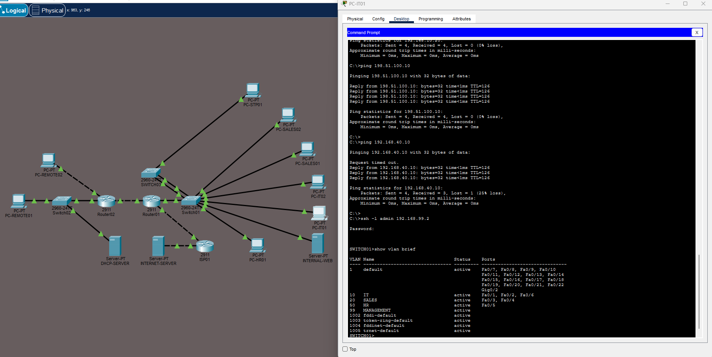

---

# Screenshot Evidence

The `screenshots` directory contains the complete build history.

| Screenshots | Topic |
| --- | --- |
| 01–09 | Initial topology, VLANs, inter-VLAN routing, DHCP, ACLs |
| 10–15 | VLAN, trunk, and default-gateway troubleshooting |
| 16–20 | MAC/ARP verification, management VLAN, SSH, management ACL |
| 21–24 | Port security configuration, violation, and recovery |
| 25–29 | Static routing, missing return route, traceroute, default route |
| 30–35 | OSPF adjacency, dynamic routes, new network advertisement, area mismatch |
| 36–37 | DHCP relay |
| 38–41 | NAT/PAT and Internet connectivity |
| 42–46 | DNS, HTTP, and TCP PAT translations |
| 47–50 | HR DHCP/DNS troubleshooting and multiple HTTP clients |
| 51–53 | Static PAT, translation table, and inbound port forwarding |
| 54–57 | Outside ACL testing and match counters |
| 58–61 | STP redundancy, failover, and recovery |
| 62–64 | Final end-to-end validation |

---

# Skills Demonstrated

## Switching

- VLAN configuration
- Access-port assignment
- 802.1Q trunking
- MAC address table verification
- Management SVI configuration
- STP root selection
- Redundant trunk links
- STP failover
- Sticky port security
- Err-disabled port recovery

## Routing

- Router-on-a-stick
- Inter-VLAN routing
- IPv4 addressing
- `/24` and `/30` subnetting
- Static routing
- Return-path troubleshooting
- Default routing
- Traceroute analysis
- OSPF neighbor formation
- OSPF route learning
- Passive interfaces
- OSPF area troubleshooting

## Network Services

- DHCP pools
- DHCP excluded addresses
- Centralized DHCP
- DHCP relay
- DNS
- A records
- HTTP services
- SSH management

## Security

- Standard ACLs
- Extended ACLs
- VTY access restrictions
- Department-specific ICMP filtering
- Internet-edge ACL filtering
- Port security
- Static PAT
- Controlled inbound service publishing

## NAT

- NAT inside/outside designation
- PAT overload
- Multiple internal hosts sharing one public address
- NAT translation table verification
- TCP translation verification
- Static TCP port forwarding

## Troubleshooting

- Layer 2 vs. Layer 3 fault isolation
- VLAN misconfiguration
- Trunk failure
- Incorrect default gateway
- Port-security violation
- Missing forward route
- Missing return route
- OSPF adjacency failure
- DHCP relay failure
- DHCP scope failure
- DNS record failure
- NAT failure
- Static PAT failure
- ACL verification
- STP failover testing

---

# Key Lessons From the Lab

One of the biggest lessons from this project was that successful troubleshooting depends on understanding where a packet should travel and identifying the first place that expected behavior stops.

A few concepts became much clearer while building the lab:

- Hosts in the same subnet can communicate directly through Layer 2 switching.
- Traffic for a different subnet must be sent to a default gateway.
- ARP resolves the next-hop IPv4 address to a local MAC address.
- VLANs create separate Layer 2 broadcast domains.
- 802.1Q trunking allows multiple VLANs to share one physical link while remaining logically separated.
- Router-on-a-stick uses tagged subinterfaces to route multiple VLANs through one physical router interface.
- Routers do not automatically know remote networks.
- Routing must work in both the forward and return directions.
- OSPF can dynamically replace many manually maintained routes.
- DHCP broadcasts require a relay when the DHCP server is on another subnet.
- PAT allows multiple private hosts to share a public IPv4 address.
- Static PAT can publish a specific internal service to an outside network.
- ACL order matters because the first matching entry determines the action.
- STP prevents Layer 2 loops while still allowing redundant physical connections.
- A failed test is more useful when I understand why the result changed after each configuration change.

---

# Lab Status

**Complete**

The final Packet Tracer file, device configurations, troubleshooting evidence, and final validation screenshots are included in this repository.

The project focuses on foundational switching, routing, network services, security, and troubleshooting while showing the progression from a basic segmented LAN into a larger multi-router network with centralized services, simulated Internet access, security controls, and Layer 2 redundancy.
