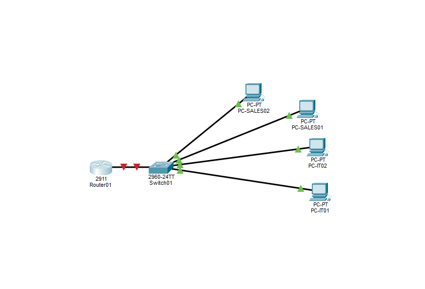
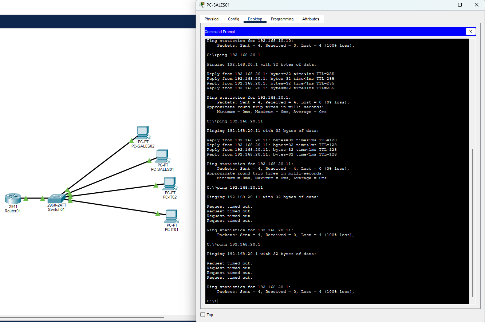
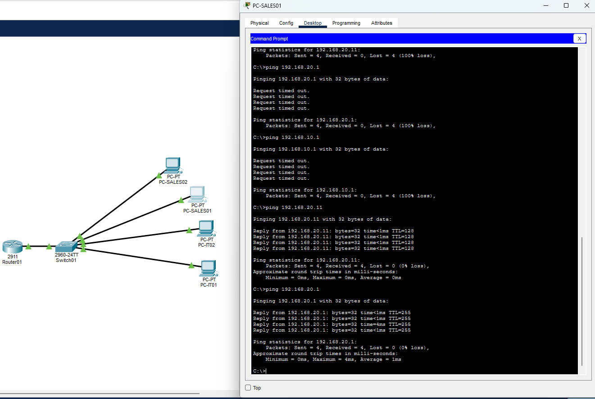
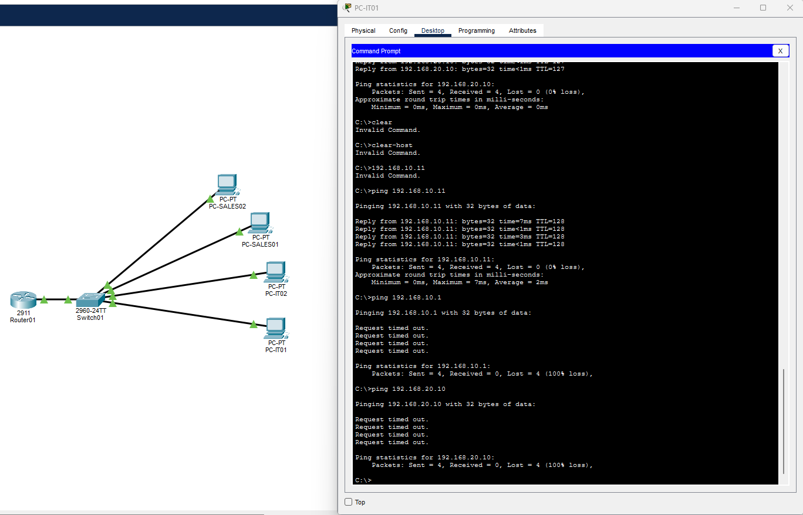
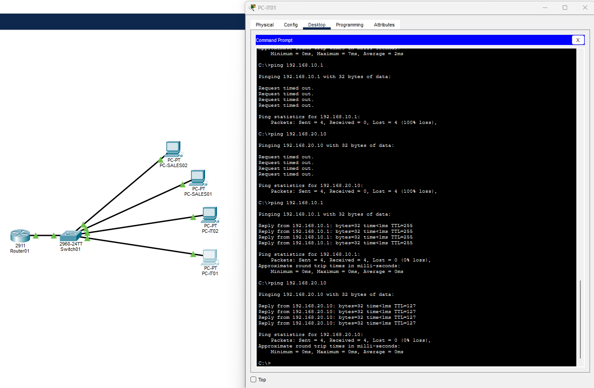
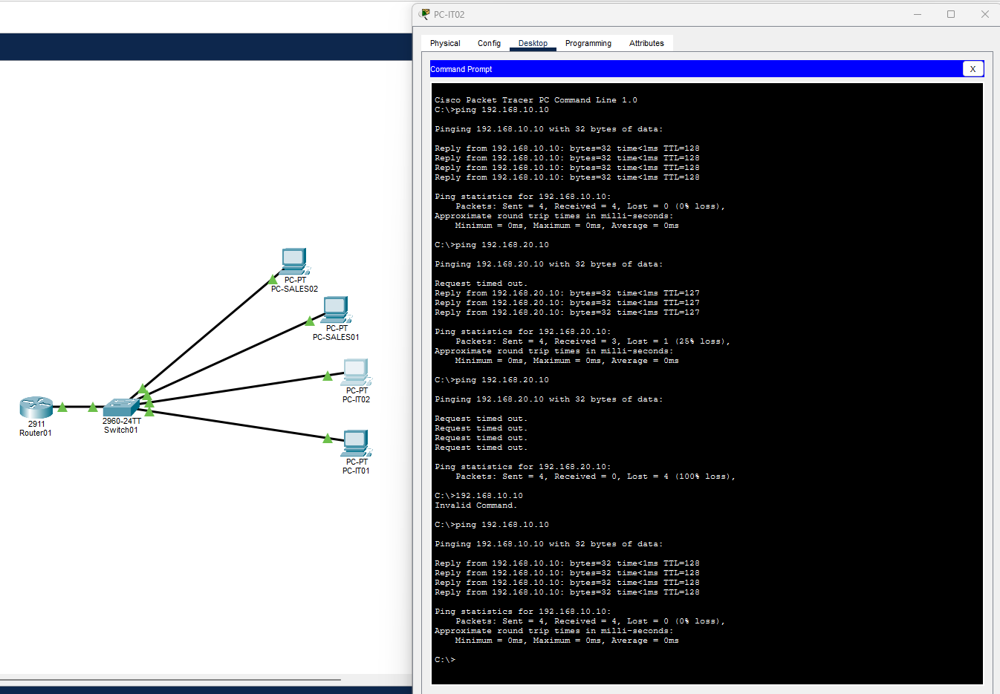
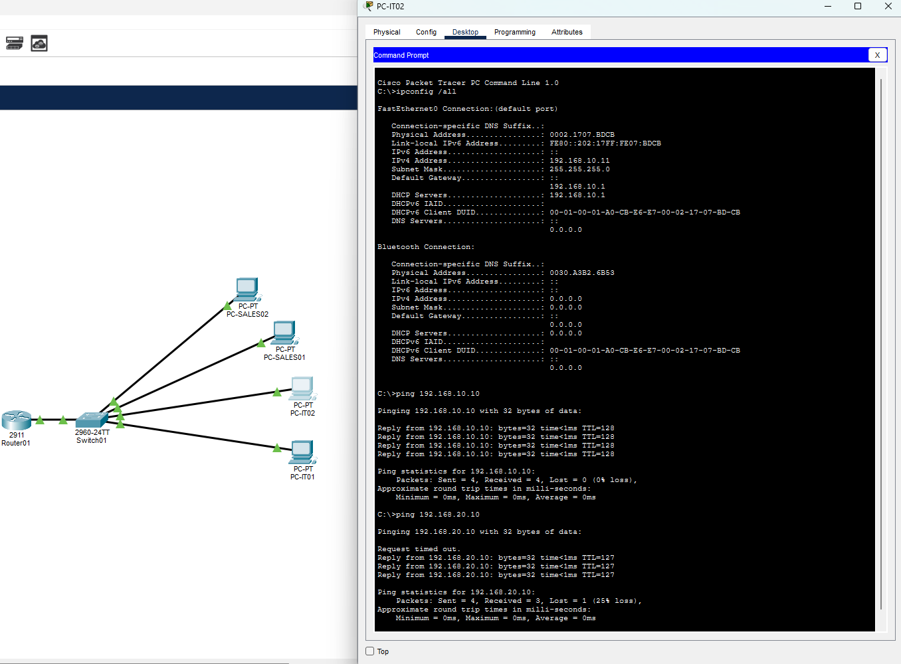

# Cisco Packet Tracer Networking Lab

## Overview

Built a small business network in Cisco Packet Tracer to practice VLAN segmentation, inter-VLAN routing, DHCP, ACLs, and network troubleshooting.

The lab separates IT and Sales into different VLANs and IP subnets while using a single router-on-a-stick connection for routing between them. I also configured DHCP for both networks, applied an ACL to control ICMP traffic between departments, and intentionally introduced configuration problems to practice isolating Layer 2 and Layer 3 failures.

## Network Topology

```text
                         ROUTER01
                    Cisco 2911 Router
                            |
                     802.1Q Trunk
                            |
                         SWITCH01
                    Cisco 2960 Switch
                    /               \
             VLAN 10               VLAN 20
                IT                   SALES
             /      \              /      \
        PC-IT01   PC-IT02    PC-SALES01 PC-SALES02
```



## Addressing Plan

| Device / Network | Address | Purpose |
| --- | --- | --- |
| VLAN 10 | `192.168.10.0/24` | IT network |
| ROUTER01 G0/0.10 | `192.168.10.1` | IT default gateway |
| PC-IT01 | DHCP | IT client |
| PC-IT02 | DHCP | IT client |
| VLAN 20 | `192.168.20.0/24` | Sales network |
| ROUTER01 G0/0.20 | `192.168.20.1` | Sales default gateway |
| PC-SALES01 | DHCP | Sales client |
| PC-SALES02 | DHCP | Sales client |

DHCP excludes `.1` through `.9` in each subnet so those addresses remain available for infrastructure or static assignments.

## VLAN Configuration

Created two VLANs on SWITCH01:

```text
VLAN 10 - IT
VLAN 20 - SALES
```

Access-port assignments:

```text
Fa0/1 -> VLAN 10 -> PC-IT01
Fa0/2 -> VLAN 10 -> PC-IT02
Fa0/3 -> VLAN 20 -> PC-SALES01
Fa0/4 -> VLAN 20 -> PC-SALES02
```

The switch-to-router link on `Gi0/1` is configured as an 802.1Q trunk so VLAN 10 and VLAN 20 can share the same physical connection to ROUTER01.


## Inter-VLAN Routing

Configured router-on-a-stick on ROUTER01 using two subinterfaces:

```text
G0/0.10 -> VLAN 10 -> 192.168.10.1/24
G0/0.20 -> VLAN 20 -> 192.168.20.1/24
```

Before routing was configured, hosts could communicate with devices inside their own VLAN but could not reach the other subnet.


After configuring the trunk, router subinterfaces, and client default gateways, traffic successfully routed between the IT and Sales networks.


## DHCP Configuration

ROUTER01 provides DHCP service for both VLANs.

Excluded addresses:

```text
192.168.10.1 - 192.168.10.9
192.168.20.1 - 192.168.20.9
```

DHCP pools:

```text
IT
Network: 192.168.10.0/24
Default Gateway: 192.168.10.1

SALES
Network: 192.168.20.0/24
Default Gateway: 192.168.20.1
```

The four client PCs successfully received leases from the correct subnet. IT clients received `192.168.10.x` addresses and Sales clients received `192.168.20.x` addresses.


## Access Control List

Created a named extended ACL called `SALES-TO-IT` and applied it inbound on the Sales router subinterface.

The ACL allows IT to initiate ICMP traffic toward Sales while preventing Sales from initiating ICMP echo requests toward IT.

```text
permit icmp 192.168.20.0 0.0.0.255 192.168.10.0 0.0.0.255 echo-reply
deny   icmp 192.168.20.0 0.0.0.255 192.168.10.0 0.0.0.255 echo
permit ip any any
```

Testing confirmed:

```text
IT -> Sales ping      ALLOWED
Sales -> IT ping      BLOCKED
```


ACL match counters were used to confirm that the permit and deny rules were processing the expected traffic.


## Troubleshooting Scenarios

### Sales PC Assigned to the Wrong VLAN

I intentionally moved the switchport connected to PC-SALES01 from VLAN 20 to VLAN 10 while leaving the PC configured for the `192.168.20.0/24` network.

**What I saw:**

- PC-SALES01 could not reach another Sales host.
- PC-SALES01 could not reach its default gateway.
- The PC still had its normal Sales IP configuration.

Because communication failed between two hosts that should have been in the same VLAN and subnet, I checked the local switching path before investigating routing. `show vlan brief` showed `Fa0/3` assigned to the wrong VLAN.



**Fix:**

Restored `Fa0/3` to VLAN 20 and verified that PC-SALES01 could again reach both another Sales host and `192.168.20.1`.



### Broken Switch-to-Router Trunk

I intentionally changed the `Gi0/1` switch-to-router link from trunk mode to access mode.

**What I saw:**

- PC-IT01 could still reach PC-IT02 in VLAN 10.
- PC-IT01 could not reach its default gateway.
- PC-IT01 could not reach the Sales subnet.

Because communication between the two IT hosts still worked, I knew local switching inside VLAN 10 was functioning. The failure started when traffic needed to leave the switch.

`show interfaces trunk` no longer showed an active trunk, and the switchport information showed that trunking was disabled.



**Fix:**

Restored `Gi0/1` to trunk mode and verified that the IT gateway and Sales subnet became reachable again.



### Incorrect Default Gateway

I intentionally changed PC-IT02's default gateway from:

```text
192.168.10.1
```

to:

```text
192.168.10.254
```

while keeping its IP address and subnet mask unchanged.

**What I saw:**

- PC-IT02 could still reach PC-IT01 in the same subnet.
- PC-IT02 could not reach the Sales subnet.
- Local VLAN communication continued working.

Because same-subnet communication still worked, I knew the local Layer 2 path was functioning. The failure only occurred when the PC needed to send traffic outside its local subnet.

Checking the client IP configuration showed that the default gateway was incorrect.



**Fix:**

Restored the default gateway to:

```text
192.168.10.1
```

PC-IT02 could then reach both local and remote networks again.



## Current Skills Demonstrated

- Cisco IOS CLI configuration
- VLAN creation and access-port assignment
- 802.1Q trunking
- Router-on-a-stick inter-VLAN routing
- IPv4 addressing and `/24` subnetting
- DHCP pools and excluded address ranges
- DHCP lease verification
- Default gateway configuration
- Extended ACL configuration
- ACL match-counter verification
- ICMP connectivity testing
- TTL interpretation
- ARP and MAC address concepts
- Layer 2 and Layer 3 troubleshooting
- VLAN assignment troubleshooting
- Trunk troubleshooting
- Default gateway troubleshooting
- Failure, diagnosis, repair, and verification workflow

## Lab Status

The lab currently includes VLAN segmentation, inter-VLAN routing, DHCP, ACL filtering, and multiple troubleshooting scenarios.

Additional switch management, routing verification, and remote administration tasks will be added as the lab continues.
